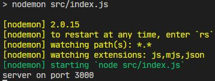

# Stick-man Atack

## Index #section

- [introduction](#introduction)
- [Installation](#installation)
    - [Download the Repository](#1-download-the-repository)
    - [Create Database](#2-create-the-database)
    - [Install Dependencies and Run](#3-install-dependencies-and-run-the-app)
- [Util Scripts](#util-scripts)
- [How to Play](#how-to-play)

## Introduction


## Installation

### 1. Download the repository
You can clone the repository executing the code below:
```git
git clone https://github.com/facuhacosta/stickman_attack.git
```
### 2. Create the database

1. Go to database folder.
2. Open **stickman_attack.sql** file and copy its content.
3. Open your Mysql terminal, paste the code and run it.
4. Go to **index.js** file within **src** folder and change lines 16 and 17 to match your MySQL user and password respectively as shown next:

```js
app.use(myConnection(mysql, {
  host: 'localhost',
  user: 'yourUser',
  password: 'YourPassword',
  port: 3306,
  database: 'stickman_attack_db',
}, 'single'));
```

This code populates the database with basic values, You can create your own databse if you like using the folowing structure as an example.

```sql
CREATE TABLE users (
  id int(10) UNSIGNED AUTO_INCREMENT PRIMARY KEY,
  name VARCHAR(20) UNIQUE NOT NULL,
  password VARCHAR(60) NOT NULL,
  score int(5) UNSIGNED DEFAULT 0,
  money int(10) UNSIGNED DEFAULT 0
);

CREATE TABLE enemies (
  id int(6) UNSIGNED AUTO_INCREMENT PRIMARY KEY,
  name VARCHAR(20) UNIQUE NOT NULL,
  health int(5) NOT NULL DEFAULT 100,
  damage int(5) NOT NULL DEFAULT 5,
  attack_speed DECIMAL(2, 2) NOT NULL DEFAULT (01.00),
  run_gif_url VARCHAR(255),
  attack_gif_url VARCHAR(255),
  money_given int(10) UNSIGNED DEFAULT 0
);

CREATE TABLE weapons (
  id int(6)  UNIQUE AUTO_INCREMENT PRIMARY KEY,
  name VARCHAR(20) NOT NULL,
  damage int(5) UNSIGNED DEFAULT 10,
  attack_speed DECIMAL(2, 2) NOT NULL DEFAULT (01.00),
  bullets int(4) UNSIGNED DEFAULT 10,
  value int(10) NOT NULL,
  image VARCHAR(255)
);
```
### 3. install dependencies and run the app
open a console or terminal withing the folder you cloned the repository an run the code below:

```node
npm install
```
and
```node
npm run dev
```
you'll recive a mesage for console similar to this:



now open [http://localhost:3000/](http://localhost:3000/) in your browser to play the game.

## Util scripts

* Install all project dependencies:
    ```node
    npm install
    ```
* Start server:
    ```node
    npm start
    ```
* Start development server:
    ```node
    npm run dev
    ```
* compile react code:
    ```node
    npm run webpack
    ```
* Run test cases:
    ```node
    npm run test
    ```
* Run test coverage:
    ```node
    npm run test:coverage
    ```
* Create component
    ```node
    npm run create-component "componentName"
    ```
    should be completly in lower case, It'll create a component folder with default files containing example code

## How to play